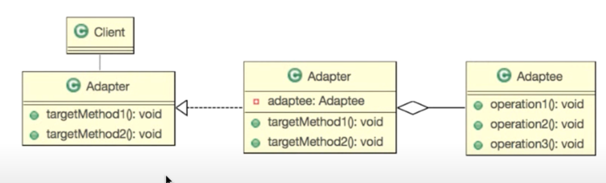

- Adapter Pattern
    - 한 클래스의 인터페이스를 클라이언트에서 사용하고자하는 다른 인터페이스로 변환한다.  
      어댑터를 이용하면 인터페이스 호환성 문제 때문에 같이 쓸 수 없는 클래스들을 연결해서 쓸 수 있다.  
      
    
      
    - 기본설계
    - 요구사항  
        - 두 수에 대한 다음 연산을 수행하는 객체를 만들어라   
          - 수의 두배의 수를 반환: twiceOf(Float): Float  
          - 수의 반(1/2)의 수를 반환: halfOf(Float): Float
        - 구현 객체 이름은 'Adapter'로 만들어라
        - 이미 구현된 Math 클래스 에서 제공하는 기능을 활용해라. 
    
    