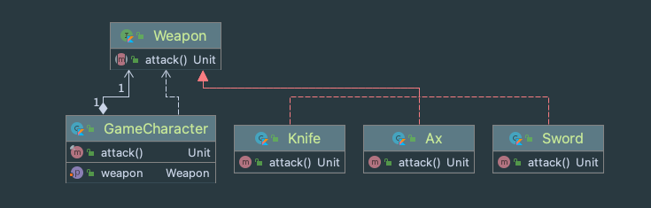

- 인터페이스 개념 
  - 기능에 대한 선언과 구현을 분리
  - 기능을 사용할 수 있는 통로를 제공  
  
- 델리게이트 개념
  - Delegate의 의미 사전적 의미는 위임 하다, 떠 넘기다, 같은 개념. 
  - 특정 객체의 기능을 사용하기 위해 다른 객체의 기능을 호출  
- 전략 패턴 개념이해 
  - 여러 알고리즘을 하나의 추상적인 접근점을 만들어 접근점에서 서로 교환 가능하도록 하는 패턴
  
    
